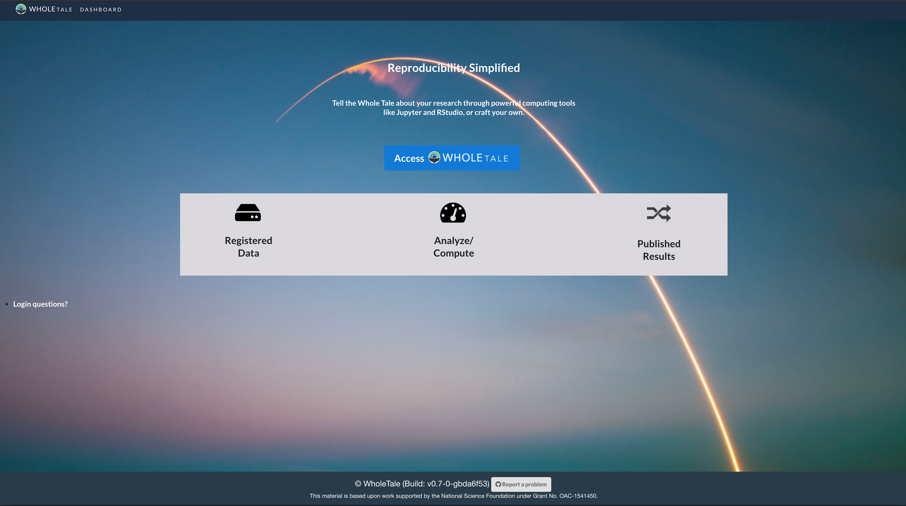
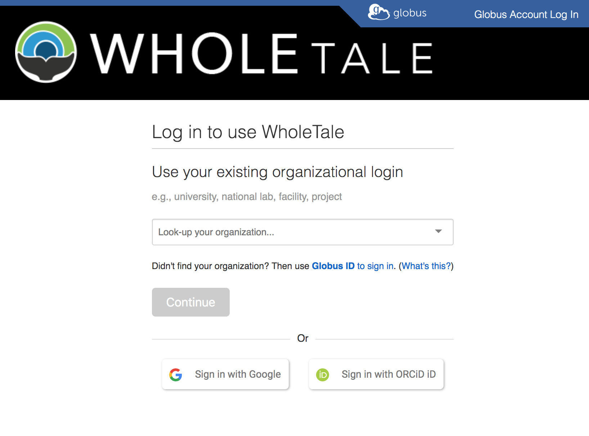
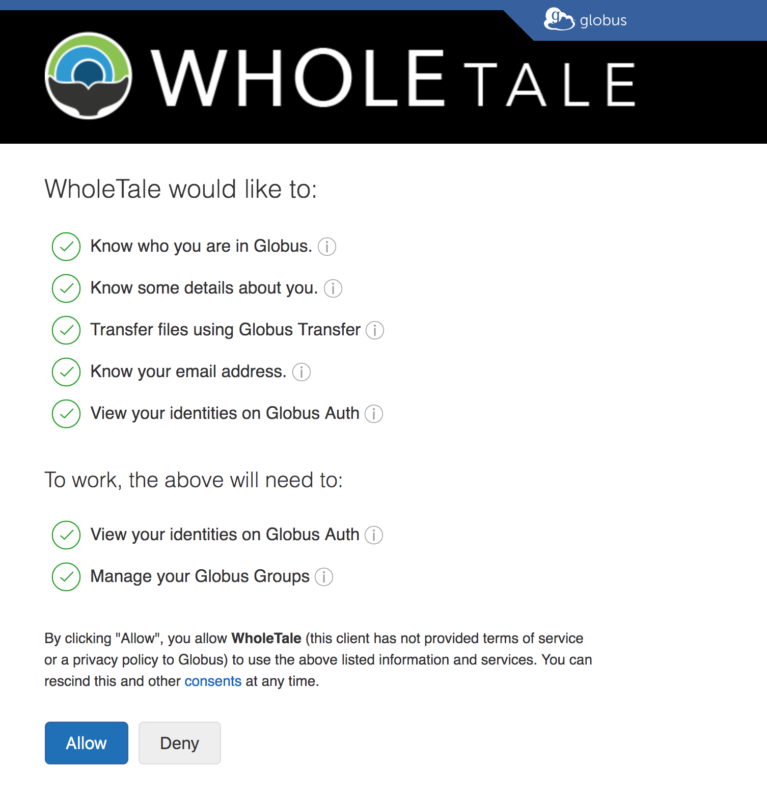

# Accessing Whole Tale

In this section you'll learn how to access the Whole Tale platform:

Questions:
* How do I access Whole Tale?
* What am I authorizing Whole Tale to do?

Objectives:
* Learn how to login to Whole Tale using your institutional credentials
* Learn about how Globus Authentication is used in Whole Tale

## Introduction

The Whole Tale system uses Globus Auth to enable users to login using their existing credentials from hundreds of research institutions and organizations worldwide as well as ORCID and Google accounts. 

## What is Globus and Globus Auth?

Globus is a research data management service used by researchers at hundreds of research institutions based at the University of Chicago. Globus is a popular tool for transferring data in high-performance computing environments.

Globus Auth is one service provided by Globus and CILogon that makes it easy for developers of research gateways, such as Whole Tale, to enable researchers to access resources via  OAuth2 and OpenID Connect. 

## Activity: Signing in to Whole Tale

Go to https://dashboard.wholetale.org and select "Access Whole Tale":

Type some part of the name of your institution such as "Washington" and then select "Continue"

If you've never accessed Whole Tale, you'll be prompted to authorize Whole Tale to access information about you via Globus Auth. Select "Allow" if you want to access Whole Tale:

A note about what you are authorizing:
* Know who you are (your name)
* Know some details about you (your profile in Globus)
* Transfer files via Globus: We can initiate transfers on your behalf to Whole Tale
* Know your email address 
* View your identities in Globus auth (if you have merged identities)

## Activity: Managing your consents

You can always rescind this consent by accessing the Globus Dashboard.
* Go to https://app.globus.org
* Select Account > Consents > Manage Your Consents
* Select "X" next to Whole Tale

You can always authorize Whole Tale again later.

## Key Points:
* Whole Tale uses Globus Auth to allow researchers to login using their institutional credentials
* You are authorizing Whole Tale to access information about you stored in Globus, but Whole Tale will never see your password
* Globus Auth also allows Whole Tale to transfer data from Globus endpoints to Whole Tale on your behalf
* You can always rescind your consent
